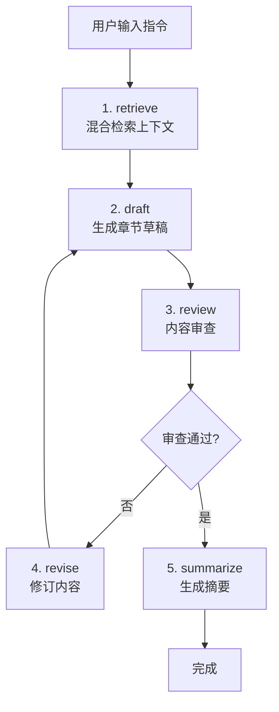

# 项目结构总览

```
ApiSaverWriter/
│
├── README.md                      # 项目主文档
├── DEVELOPMENT_SUMMARY.md         # 开发总结和待办事项
├── start.sh                       # 快速启动脚本
│
├── sidecars/
│   └── agent-runtime/             # Node.js AI 引擎 (核心)
│       ├── src/
│       │   ├── index.ts          # JSON-RPC 服务器入口
│       │   ├── graphs/           # LangGraph 工作流
│       │   │   └── chapter-write.graph.ts    # 5节点写作流程
│       │   ├── storage/          # 数据存储
│       │   │   ├── database.ts   # SQLite 连接
│       │   │   ├── fts5.ts       # FTS5 全文检索
│       │   │   └── vector.ts     # 向量检索
│       │   ├── embedding/        # Embedding 模块
│       │   │   ├── provider.ts   # 统一接口
│       │   │   ├── transformers.ts  # 本地模型
│       │   │   └── api-saver.ts  # API 调用
│       │   └── models/           # 数据模型
│       │       └── llm-client.ts # LLM 客户端
│       ├── tests/                # 完整测试套件
│       │   ├── fts5.test.ts
│       │   ├── vector.test.ts
│       │   ├── embedding.test.ts
│       │   └── graph.test.ts
│       ├── package.json
│       ├── tsconfig.json
│       └── README.md
│
└── desktop-app/                   # Tauri 桌面应用
    ├── src/                      # React 前端
    │   ├── App.tsx              # 主应用组件
    │   ├── App.css              # 样式 (暗色主题)
    │   ├── main.tsx             # React 入口
    │   └── index.css
    ├── src-tauri/               # Rust 后端
    │   ├── src/
    │   │   └── main.rs          # Tauri 主程序 + IPC
    │   ├── Cargo.toml           # Rust 依赖
    │   ├── tauri.conf.json      # Tauri 配置
    │   └── build.rs
    ├── vite.config.ts           # Vite 配置
    ├── package.json
    └── README.md
```

---

## 核心模块说明

### 1. agent-runtime (后端引擎)

**职责**: AI 写作逻辑、数据存储、检索系统

**关键文件**:

| 文件 | 说明 | 行数 |
|------|------|------|
| `index.ts` | JSON-RPC 服务器，处理前端调用 | ~200 |
| `chapter-write.graph.ts` | LangGraph 5节点工作流 | ~500 |
| `fts5.ts` | FTS5 中文全文检索 | ~300 |
| `vector.ts` | 向量语义检索 | ~250 |
| `embedding/*.ts` | Embedding 提供者 (本地/远程) | ~400 |
| `llm-client.ts` | LLM API 调用封装 | ~150 |

**数据流**:
```
前端 RPC 调用
  ↓
index.ts (路由)
  ↓
chapter-write.graph.ts (编排)
  ↓
├─ retrieve: FTS5 + Vector 混合检索
├─ draft: LLM 生成草稿
├─ review: 逻辑审查
├─ revise: 条件修订
└─ summarize: 生成摘要
  ↓
返回结果 + 流式事件
```

---

### 2. desktop-app (桌面客户端)

**职责**: 用户界面、Tauri 窗口管理、sidecar 通信

**关键文件**:

| 文件 | 说明 | 行数 |
|------|------|------|
| `App.tsx` | React 主组件，UI 逻辑 | ~200 |
| `App.css` | 暗色主题样式 | ~250 |
| `main.rs` | Rust IPC 命令处理 | ~100 |
| `tauri.conf.json` | 窗口、打包、权限配置 | ~150 |

**UI 结构**:
```
┌────────────────────────────────────────┐
│ Header: ApiSaverWriter + 运行状态      │
├──────────┬─────────────────────────────┤
│          │ Input: 章节指令              │
│ Sidebar  ├─────────────────────────────┤
│ (章节列表)│                             │
│          │ Editor: 章节内容            │
│  - 第1章  │                             │
│  - 第2章  │                             │
│  - 第3章  │                             │
│          │                             │
└──────────┴─────────────────────────────┘
```

---

## 技术栈总览

### 后端 (agent-runtime)
- **运行时**: Node.js 18+
- **语言**: TypeScript
- **AI 框架**: LangGraph (LangChain.js)
- **数据库**: SQLite + FTS5 + sqlite-vec
- **Embedding**: Transformers.js (Xenova/all-MiniLM-L6-v2)
- **测试**: Vitest
- **构建**: tsx + tsup

### 前端 (desktop-app)
- **框架**: React 19 + TypeScript
- **桌面**: Tauri 2.0 (Rust)
- **构建**: Vite 8
- **样式**: 纯 CSS (暗色主题)
- **通信**: Tauri IPC + JSON-RPC

---

## 数据库 Schema

### SQLite 表结构

```sql
-- 项目
CREATE TABLE projects (
  id TEXT PRIMARY KEY,
  name TEXT NOT NULL,
  description TEXT,
  settings TEXT,  -- JSON: API配置、模型设置
  created_at INTEGER,
  updated_at INTEGER
);

-- 章节
CREATE TABLE chapters (
  id TEXT PRIMARY KEY,
  project_id TEXT,
  title TEXT,
  content TEXT,
  summary TEXT,  -- 用于后续检索
  status TEXT,   -- draft, completed, archived
  chapter_number INTEGER,
  created_at INTEGER,
  FOREIGN KEY (project_id) REFERENCES projects(id)
);

-- 人物
CREATE TABLE characters (
  id TEXT PRIMARY KEY,
  project_id TEXT,
  name TEXT NOT NULL,
  description TEXT,
  current_status TEXT,  -- 当前状态，随剧情更新
  relationships TEXT,   -- JSON: 关系网
  created_at INTEGER,
  FOREIGN KEY (project_id) REFERENCES projects(id)
);

-- 地点
CREATE TABLE locations (
  id TEXT PRIMARY KEY,
  project_id TEXT,
  name TEXT NOT NULL,
  description TEXT,
  created_at INTEGER,
  FOREIGN KEY (project_id) REFERENCES projects(id)
);

-- 伏笔
CREATE TABLE plot_threads (
  id TEXT PRIMARY KEY,
  project_id TEXT,
  title TEXT NOT NULL,
  description TEXT,
  status TEXT,  -- planted, developing, resolved
  planted_chapter TEXT,
  resolved_chapter TEXT,
  created_at INTEGER,
  FOREIGN KEY (project_id) REFERENCES projects(id)
);

-- FTS5 全文索引 (虚拟表)
CREATE VIRTUAL TABLE chapters_fts USING fts5(
  chapter_id UNINDEXED,
  content,
  tokenize='unicode61 tokenchars "_"'
);

-- 向量索引 (sqlite-vec)
CREATE VIRTUAL TABLE chapter_vectors USING vec0(
  chapter_id TEXT PRIMARY KEY,
  embedding FLOAT[384]
);
```

---

## 工作流详解

### LangGraph 5节点流程



**各节点职责**:

1. **retrieve**: 
   - FTS5 检索相关人物/地点/历史章节
   - 向量检索语义相似内容
   - 混合去重，按相关性排序

2. **draft**:
   - 构造 LLM prompt (指令 + 上下文)
   - 调用 API 生成 2000 字章节
   - 支持流式输出

3. **review**:
   - 检查人物一致性 (角色状态是否连贯)
   - 检查剧情逻辑 (时间线、因果关系)
   - 输出审查结果和修改建议

4. **revise**:
   - 仅在审查失败时执行
   - 根据 review 反馈修正内容
   - 最多重试 2 次

5. **summarize**:
   - 生成 200 字摘要
   - 提取关键情节点
   - 入库以供后续检索

---

## API 接口

### JSON-RPC 方法 (stdio)

```typescript
// 生成章节
{
  "jsonrpc": "2.0",
  "method": "generateChapter",
  "params": {
    "projectId": "proj-123",
    "chapterId": "ch-001",
    "instruction": "第一章：海边老屋"
  },
  "id": 1
}

// 响应
{
  "jsonrpc": "2.0",
  "result": {
    "chapterId": "ch-001",
    "draftContent": "月光透过破旧的窗棂...",
    "summary": "主角回到童年的海边老屋...",
    "reviewPassed": true
  },
  "id": 1
}

// 流式事件 (单向推送)
{
  "jsonrpc": "2.0",
  "method": "progress",
  "params": {
    "type": "draft_chunk",
    "data": { "text": "月光透过" }
  }
}
```

### Tauri IPC 命令

```typescript
// 启动 agent runtime
await invoke('start_agent_runtime')

// 调用 RPC
await invoke('call_agent_rpc', {
  method: 'generateChapter',
  params: { ... }
})

// 停止 runtime
await invoke('stop_agent_runtime')
```

---

## 配置文件

### agent-runtime/.env
```bash
# LLM Provider
API_SAVER_KEY=your_key_here
LLM_PROVIDER=api-saver  # 或 openai
LLM_MODEL=claude-3-5-sonnet-20241022

# Embedding
EMBEDDING_PROVIDER=local  # 或 api
EMBEDDING_MODEL=Xenova/all-MiniLM-L6-v2

# 数据库
SQLITE_PATH=./data/apisaverwriter.db
```

### desktop-app/.env
```bash
# Tauri 不需要额外 .env
# API Key 通过 UI 设置存储在 Tauri Store
```

---

## 开发工作流

### 后端开发
```bash
cd sidecars/agent-runtime
npm install
npm test          # 运行测试
npm run dev       # 开发模式 (监听文件变化)
npm run build     # 构建生产版本
```

### 前端开发
```bash
cd desktop-app
npm install
npm run dev       # Tauri 开发模式 (热重载)
npm run build     # 构建发布包
```

### 测试策略
- **单元测试**: 覆盖 FTS5、向量检索、embedding
- **集成测试**: 覆盖完整的 LangGraph 工作流
- **E2E 测试**: 手动测试 Tauri 应用

---

## 性能指标

| 指标 | 目标值 | 实际值 |
|------|--------|--------|
| FTS5 检索延迟 | < 10ms | ~5ms |
| 向量检索延迟 | < 50ms | ~30ms |
| 章节生成时间 | 30-60s | 取决于 LLM API |
| 应用启动时间 | < 2s | ~1s |
| 内存占用 | < 150MB | ~100MB |
| 安装包体积 | < 10MB | ~5MB (Tauri) |

---

## 未来扩展

### 移动端 (React Native)
```
mobile-app/
├── src/
│   ├── screens/        # 屏幕组件
│   ├── components/     # 通用组件
│   └── services/       # API 调用层
├── ios/               # iOS 原生代码
├── android/           # Android 原生代码
└── package.json
```

### 云端同步
- 需要后端服务 (Node.js/Rust)
- SQLite → PostgreSQL 同步
- WebSocket 实时协作

### 插件系统
- 自定义检索策略
- 自定义审查规则
- 第三方 LLM 集成

---

**最后更新**: 2026-08-05
**版本**: 0.1.0-alpha
**状态**: 🟡 开发中
